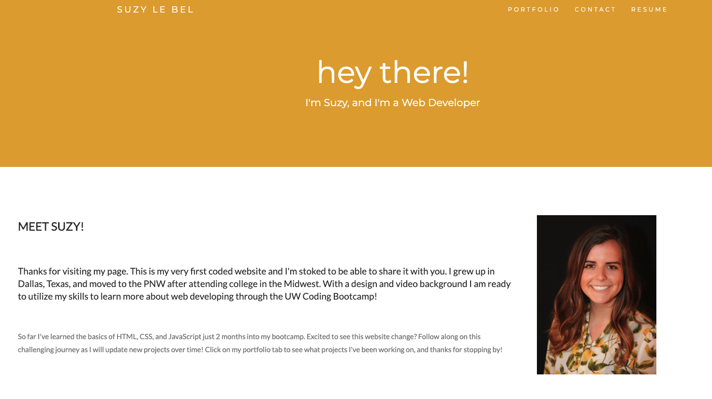
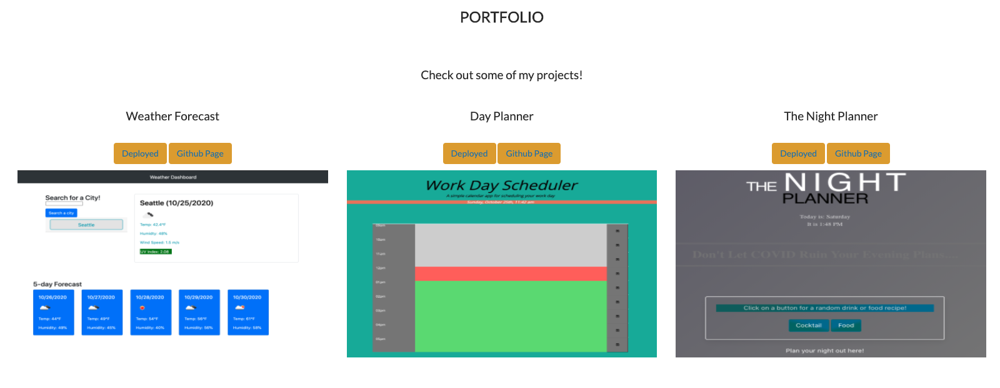
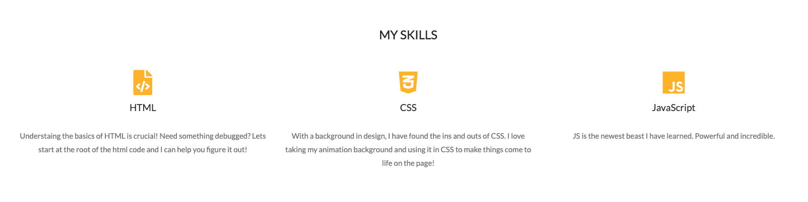
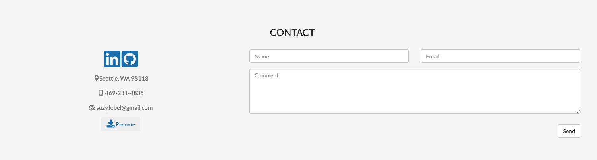

**HOMEWORK ASSIGNMENT 2: My Portfolio**

Explore the [project page](https://github.com/suzylebel/portfolio)
View the GitHub [page](https://suzylebel.github.io/portfolio/)

## Click here to watch 
[video walkthrough of website](Assets/readme_images/Portfolio.gif) 
   

# Updated Portfolio Jan 2021

Edits: Updated January 9, 2021 from previous portfolio update. 
Added projects and added more detail about what I have learned in the bootcamp. Updated my ReadMe and added a animated gif for a workthrough of the portfolio page. 

## Requirements

* Submit an updated portfolio featuring Project 2 and two exemplary homework assignments.

* Submit an updated GitHub profile with pinned repositories featuring Project 1 and two exemplary assignments.

* Submit an updated resume

* Submit an updated LinkedIn profile

## Grading

## Instructions

1. [Updated Portfolio](https://suzylebel.github.io/portfolio/index.html)
2. [GitHub Profile](https://github.com/suzylebel)
3. [Updated Resume](https://github.com/suzylebel/portfolio/blob/main/Assets/suzylebel_resume_download.pdf)
4. [Updated LinkedIn](https://www.linkedin.com/in/suzanne-le-bel-b24032125/)

## Updated Portfolio

### Design Images

